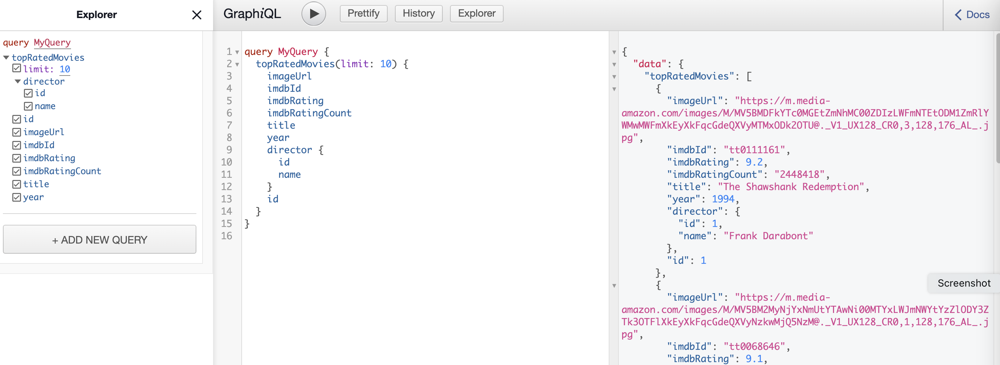
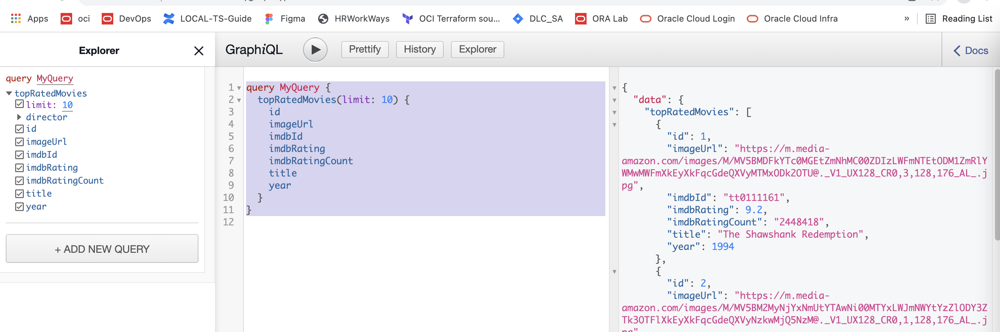

Sample illustration of GRAPHQL with FASTAPI & STRABERRY and deploy it over OCI OKE

-------

- Deployment manifest - [deployment_spec.yaml](deployment_spec.yaml)

- Dockerfile - [Dockerfile](Dockerfile)


Sample Query

```
query MyQuery {
  topRatedMovies(limit: 10) {
    id
    imageUrl
    imdbId
    imdbRating
    imdbRatingCount
    title
    year
  }
}

```

Sample output 





 ---

Credits for the base code - https://github.com/strawberry-graphql/examples/tree/main/fastapi-sqlalchemy 